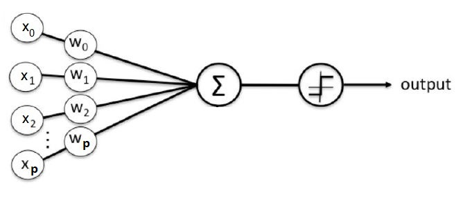
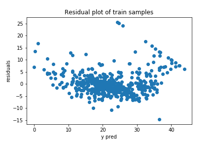

# Perceptron

<b> 1. Introduzione </b>
  
Il percettrone venne proposto da Frank Rosenblatt nel 1958. La struttura è la seguente:
  

 
Considerando un numero p di predittori, il vettore <i> X = [x1, x2, ... , xp] </i> rappresenta l'input del percettrone. Quest'ultimo viene poi moltiplicato per il vettore dei pesi <i> W = [w1, w2, ... , wp] </i>. Detto ciò, l'output può essere espresso matematicamente dalla formula:
  

  
in cui la funzione g(), detta <i> funzione di attivazione </i>, è spesso rappresentata dalla funzione sigmoidea matematicamente esprimibile in questo modo:
  

  
Quest'ultima ha un dominio di valori nel range [0,1] rendendo così il percettrone un classificatore binario. In particolare, supponendo di avere due classi A e B, il valore ritornato dalla funzione sigmoidea esprime la probabilità di appartenenza dell'esempio X alla classe A o B.
  
Di estrema importanza è il vettore dei pesi W. Il loro valore viene determinato durante la fase di apprendimento <i> (training) </i>, in maniera tale che la differenza (target - output) sia la più piccola possibile. Ma quanto piccola? Considerando (target - output) come la funzione di loss, l'obiettivo è quello di raggiungere il <i> minimo globale </i>. In particolare con il termine target ci riferiamo al valore con cui labelliamo l'osservazione X <i> (valore atteso) </i>, al contrario, con il termine output ci riferiamo al valore restituito dal percettrone <i>(predizione) </i>. 
 
I pesi vengono determinati attraverso la regola di aggiornamento <i> delta rule </i> (discesa del gradiente). Considerando un solo neurone (appunto il percettrone) possiamo esprimere la delta rule in questo modo:
  

  
el i conseguente aggiornamento del vettore peso:
  

   
<b> 2. Regressione </b>
  
Modificando la funzione di attivazione possiamo ottenere un modello regressivo. In particolare, sostituiamo la funzione sigmoidea con la funzione ReLU. Quest'ultima viene ad esprimersi matematicamente:
 < 

  
Detto ciò, il nostro percettrone costituirà un modello definito dal seguente hyperpiano:
  

  
in cui <i> w0 </i> rappresenta l'intercetta mentre w1, ... , wp le relative pendenze.
   
<b> 3. Plot residui </b>
  
Di seguito posto il plot dei residui calcolato sul training set sia del percettrone sia eseguendo una LinearRegression. Il dataset utilizzato è <a href="https://scikit-learn.org/stable/modules/generated/sklearn.datasets.load_boston.html">Boston house-prices</a> 
<table>
        <tr><td><b>Perceptron</b></td><td><b>LinearRegression</b></td></tr>
        <tr><td></td><td></td></tr>
</table>
